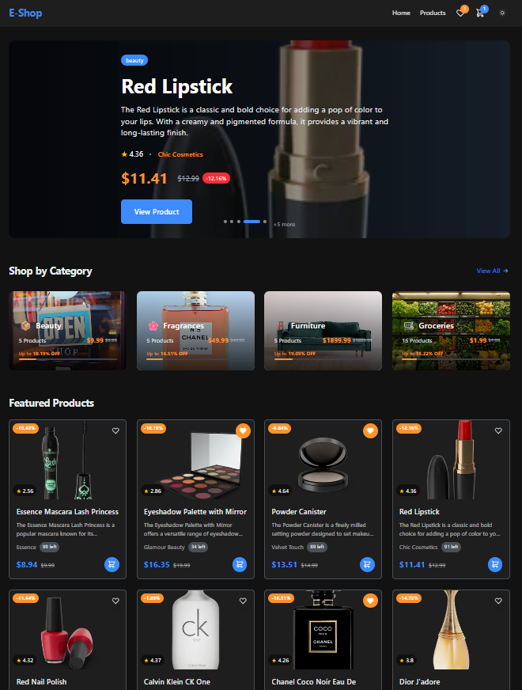

# 🛍️ E-Commerce - Modern React Shopping Platform

![E-Commerce Platform]



A modern, feature-rich e-commerce platform built with React 18, TypeScript, and Tailwind CSS. This project demonstrates best practices in state management, UI/UX design, and responsive web development.

<p align="center">
  
  
  
  
  
  
</p>


## ✨ Features

### 🎨 Modern UI/UX
- **Dual Theme Support**: Elegant Light and Dark themes with smooth transitions
- **Fully Responsive**: Optimized for all devices (mobile, tablet, desktop)
- **Interactive Components**: Animated product cards, slider, and category sections
- **Professional Design**: Clean typography, consistent spacing, and visual hierarchy

### 🛒 Shopping Features
- **Product Catalog**: Browse products with advanced filtering and search
- **Shopping Cart**: Add/remove items, update quantities, real-time price calculation
- **Wishlist**: Save favorite products for later
- **Product Details**: High-quality images, descriptions, ratings, and similar products
- **Category Navigation**: Visual category cards with product previews

### 🚀 Technical Highlights
- **Type Safety**: Full TypeScript support with comprehensive type definitions
- **State Management**: Context API + useReducer for predictable state updates
- **Persistent Storage**: localStorage integration for cart, wishlist, and theme preferences
- **API Integration**: Axios with error handling and loading states
- **Performance**: Optimized re-renders with useMemo and proper dependency arrays


## 🏗️ Project Structure

```
E-commerce-2/
├── 📁 public/                 # Static assets
│   └── 🖼️ Ecommerce.png       # Project logo
├── 📁 src/
│   ├── 📁 Types/              # TypeScript type definitions
│   │   └── index.ts           # All shared types and interfaces
│   ├── 📁 components/         # Reusable UI components
│   │   ├── Header.tsx         # Navigation bar with theme toggle
│   │   ├── Footer.tsx         # Page footer with links
│   │   ├── Slider.tsx         # Auto-playing product slider
│   │   └── ProductCard.tsx    # Product preview card
│   ├── 📁 context/            # State management
│   │   └── AppContext.tsx     # Context + useReducer implementation
│   ├── 📁 pages/              # Page components
│   │   ├── Home.tsx           # Landing page with slider & categories
│   │   ├── Products.tsx       # All products with filters
│   │   ├── ProductDetails.tsx # Single product view
│   │   ├── Cart.tsx           # Shopping cart
│   │   └── Wishlist.tsx       # Saved items
│   ├── 📄 App.tsx              # Main app component with routing
│   ├── 🎨 index.css            # Global styles with theme variables
│   └── 📄 main.tsx             # Entry point
├── ⚙️ .env                     # Environment variables
├── ⚙️ .gitignore                # Git ignore rules
├── 📝 README.md                 # Project documentation
├── ⚙️ package.json              # Dependencies and scripts
├── ⚙️ tsconfig.json             # TypeScript configuration
└── 📄 vite.config.ts            # Vite configuration
```

## 🧠 State Management with Context API & useReducer

### Why Context API + useReducer?

This project uses a combination of Context API and useReducer for state management instead of Redux or other alternatives. Here's why:

#### **Context API**
- Built into React, no additional dependencies
- Perfect for sharing global state across components
- Simple to implement and understand
- Works seamlessly with TypeScript

#### **useReducer**
- Predictable state updates through actions
- Centralized state logic in one place
- Easy to debug with action types
- Similar pattern to Redux but lighter

### Implementation Overview

```typescript
// 1. Define State and Action Types
interface AppState {
  products: Product[];
  cart: CartItem[];
  wishlist: number[];
  theme: 'light' | 'dark';
  // ... other state
}

type Action =
  | { type: 'ADD_TO_CART'; payload: Product }
  | { type: 'TOGGLE_WISHLIST'; payload: number }
  | { type: 'TOGGLE_THEME' }
  // ... other actions

// 2. Create Reducer
const appReducer = (state: AppState, action: Action): AppState => {
  switch (action.type) {
    case 'ADD_TO_CART':
      // Immutable state update
      return { ...state, cart: [...state.cart, action.payload] };
    
    case 'TOGGLE_THEME':
      return { ...state, theme: state.theme === 'light' ? 'dark' : 'light' };
    
    // ... other cases
  }
};

// 3. Create Context
const AppContext = createContext<AppContextType | undefined>(undefined);

// 4. Provider Component
export const AppProvider: React.FC<{ children: ReactNode }> = ({ children }) => {
  const [state, dispatch] = useReducer(appReducer, initialState);
  
  // Actions
  const addToCart = (product: Product) => {
    dispatch({ type: 'ADD_TO_CART', payload: product });
  };
  
  return (
    <AppContext.Provider value={{ state, addToCart }}>
      {children}
    </AppContext.Provider>
  );
};

// 5. Custom Hook for easy access
export const useAppContext = () => {
  const context = useContext(AppContext);
  if (!context) throw new Error('useAppContext must be used within AppProvider');
  return context;
};
```

### Benefits in This Project

1. **Predictable State Updates**: Every state change is dispatched as an action
2. **Centralized Logic**: All state modifications in one place (reducer)
3. **Type Safety**: Full TypeScript support for actions and state
4. **Performance**: Prevents prop drilling and unnecessary re-renders
5. **Persistence**: Easy integration with localStorage for data persistence

```typescript
// Example: Using the context in components
const Cart = () => {
  const { state, addToCart, removeFromCart } = useAppContext();
  
  return (
    <div>
      {state.cart.map(item => (
        <CartItem 
          key={item.id} 
          item={item}
          onRemove={() => removeFromCart(item.id)}
        />
      ))}
    </div>
  );
};
```

## 🎨 Theme System

The project features a sophisticated dual-theme system:

### Light Theme
- **Background**: `#FFFFFF` - Clean white background
- **Text**: `#121212` - Deep black for readability
- **Accent**: `#0A58CA` - Professional blue for buttons
- **Borders**: `#E9ECEF` - Soft gray for subtle separation
- **Highlights**: `#FD7E14` - Orange for CTAs and offers

### Dark Theme
- **Background**: `#121212` - Rich dark background
- **Text**: `#E9ECEF` - Soft white for eye comfort
- **Accent**: `#3D8BFD` - Vibrant blue that pops in dark
- **Borders**: `#495057` - Muted gray for depth
- **Highlights**: `#FF922B` - Warm orange for attention

## 🚀 Getting Started

### Prerequisites
- Node.js (v18 or higher)
- npm or yarn

### Installation

1. **Clone the repository**
```bash
git clone https://github.com/FahdAmmar/E-Commerce-.git
cd e-commerce-2
```

2. **Install dependencies**
```bash
npm install
```

3. **Set up environment variables**
Create a `.env` file in the root directory:
```env
VITE_API_BASE_URL=https://dummyjson.com
VITE_API_TIMEOUT=10000
```

4. **Run the development server**
```bash
npm run dev
```

5. **Build for production**
```bash
npm run build
npm run preview
```

## 📦 Key Dependencies

- **React 18**: Modern UI library with hooks
- **TypeScript**: Type safety and better developer experience
- **Tailwind CSS**: Utility-first CSS framework
- **React Router DOM**: Navigation and routing
- **Axios**: HTTP client for API requests
- **Vite**: Fast build tool and development server

## 🔒 Security Features

- Environment variables for sensitive data
- Axios interceptors for request/response handling
- Input validation and sanitization
- Protected routes (implement as needed)

## 🌟 Key Features in Detail

### 1. **Smart Product Slider**
- Auto-playing every 3 seconds
- Manual navigation controls
- Pause on hover
- Product information overlay

### 2. **Advanced Filtering**
- Search by product name/description
- Filter by category
- Sort by price, rating, discount
- Price range slider

### 3. **Persistent Cart**
- Items saved in localStorage
- Real-time price calculation
- Quantity management
- Promo code system

### 4. **Wishlist Management**
- Save favorite items
- Persistent storage
- Quick add to cart
- Similar product suggestions

### 5. **Responsive Design**
- Mobile-first approach
- Adaptive layouts
- Touch-friendly interfaces
- Optimized images

## 🧪 Testing

Run tests (when implemented):
```bash
npm run test
```

## 📈 Performance Optimizations

- Code splitting with React.lazy
- Image optimization and lazy loading
- Memoized components with React.memo
- Debounced search inputs
- Virtual scrolling for long lists (optional)

## 📝 License

This project is licensed under the MIT License - see the [LICENSE](LICENSE) file for details.

## 👏 Acknowledgments

- [DummyJSON](https://dummyjson.com/) for the free product API
- [Unsplash](https://unsplash.com/) for beautiful category images
- [Tailwind CSS](https://tailwindcss.com/) for the amazing utility framework
- [React Community](https://reactjs.org/community/) for excellent documentation


---

**Made with ❤️ using React, TypeScript, and Tailwind CSS**